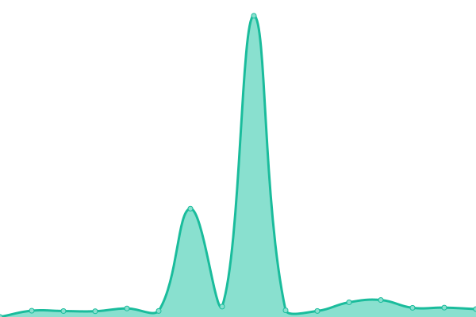
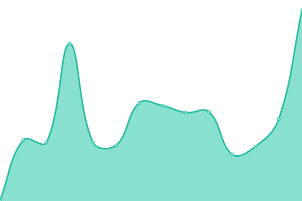
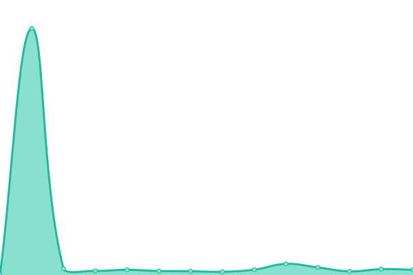
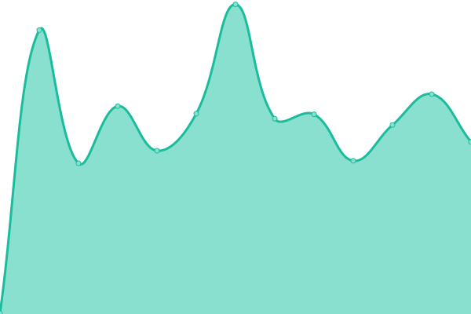

# [📈 Live Status](https://demo.upptime.js.org): <!--live status--> **🟩 All systems operational**

This repository contains the open-source uptime monitor and status page for [Karolis Pocius](https://demo.upptime.js.org), powered by [Upptime](https://github.com/upptime/upptime).

With [Upptime](https://upptime.js.org), you can get your own unlimited and free uptime monitor and status page, powered entirely by a GitHub repository. We use [Issues](https://github.com/kpocius/uptime/issues) as incident reports, [Actions](https://github.com/kpocius/uptime/actions) as uptime monitors, and [Pages](https://demo.upptime.js.org) for the status page.

<!--start: status pages-->
<!-- This summary is generated by Upptime (https://github.com/upptime/upptime) -->
<!-- Do not edit this manually, your changes will be overwritten -->
<!-- prettier-ignore -->
| URL | Status | History | Response Time | Uptime |
| --- | ------ | ------- | ------------- | ------ |
|  [Caddy](https://poci.us/healthz) | 🟩 Up | [caddy.yml](https://github.com/kpocius/uptime/commits/HEAD/history/caddy.yml) | 

 163ms
     
 | 

<a href="https://status.poci.us/history/caddy">100.00%</a>
    

|  [SearXNG](https://s.poci.us/healthz) | 🟩 Up | [sear-xng.yml](https://github.com/kpocius/uptime/commits/HEAD/history/sear-xng.yml) | 

 515ms
     
 | 

<a href="https://status.poci.us/history/sear-xng">99.90%</a>
    

|  [GoToSocial](https://gts.poci.us/api/v2/instance) | 🟩 Up | [go-to-social.yml](https://github.com/kpocius/uptime/commits/HEAD/history/go-to-social.yml) | 

 133ms
     
 | 

<a href="https://status.poci.us/history/go-to-social">100.00%</a>
    

|  [The Lounge](https://irc.poci.us) | 🟩 Up | [the-lounge.yml](https://github.com/kpocius/uptime/commits/HEAD/history/the-lounge.yml) | 

 333ms
     
 | 

<a href="https://status.poci.us/history/the-lounge">99.91%</a>
    

|  [Matrix](https://matrix.poci.us) | 🟩 Up | [matrix.yml](https://github.com/kpocius/uptime/commits/HEAD/history/matrix.yml) | 

 123ms
     
 | 

<a href="https://status.poci.us/history/matrix">100.00%</a>
    

|  [Caddy Proxy](https://poci.us/feed/vilnius) | 🟩 Up | [caddy-proxy.yml](https://github.com/kpocius/uptime/commits/HEAD/history/caddy-proxy.yml) | 

 386ms
     
 | 

<a href="https://status.poci.us/history/caddy-proxy">100.00%</a>
    

|  [Globalping](https://globalping.io) | 🟩 Up | [globalping.yml](https://github.com/kpocius/uptime/commits/HEAD/history/globalping.yml) | 

 130ms
     
 | 

<a href="https://status.poci.us/history/globalping">99.28%</a>
    

<!--end: status pages-->

[**Visit our status website →**](https://status.poci.us)

## 📄 License

- Powered by: [Upptime](https://github.com/upptime/upptime)
- Code: [MIT](./LICENSE) © [Anand Chowdhary](https://anandchowdhary.com), supported by [Pabio](https://pabio.com)
- Data in the `./history` directory: [Open Database License](https://opendatacommons.org/licenses/odbl/1-0/)
