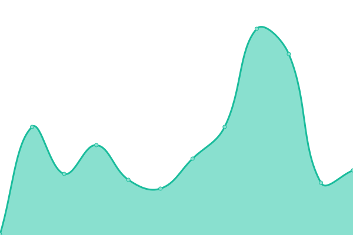

# [📈 Live Status](https://demo.upptime.js.org): <!--live status--> **🟧 Partial outage**

This repository contains the open-source uptime monitor and status page for [Karolis Pocius](https://demo.upptime.js.org), powered by [Upptime](https://github.com/upptime/upptime).

With [Upptime](https://upptime.js.org), you can get your own unlimited and free uptime monitor and status page, powered entirely by a GitHub repository. We use [Issues](https://github.com/kpocius/uptime/issues) as incident reports, [Actions](https://github.com/kpocius/uptime/actions) as uptime monitors, and [Pages](https://demo.upptime.js.org) for the status page.

<!--start: status pages-->
<!-- This summary is generated by Upptime (https://github.com/upptime/upptime) -->
<!-- Do not edit this manually, your changes will be overwritten -->
<!-- prettier-ignore -->
| URL | Status | History | Response Time | Uptime |
| --- | ------ | ------- | ------------- | ------ |
|  [SearXNG](https://s.poci.us/healthz) | 🟩 Up | [searxng.yml](https://github.com/kpocius/uptime/commits/HEAD/history/searxng.yml) | 

 172ms
     
 | 

<a href="https://status.poci.us/history/searxng">100.00%</a>
    

|  [GoToSocial](https://gts.poci.us/about) | 🟩 Up | [gotosocial.yml](https://github.com/kpocius/uptime/commits/HEAD/history/gotosocial.yml) | 

 0ms
     
 | 

<a href="https://status.poci.us/history/gotosocial">100.00%</a>
    

|  [The Lounge](https://irc.poci.us) | 🟩 Up | [thelounge.yml](https://github.com/kpocius/uptime/commits/HEAD/history/thelounge.yml) | 

 153ms
     
 | 

<a href="https://status.poci.us/history/thelounge">100.00%</a>
    

|  [The Lounge (Public)](https://lounge.poci.us) | 🟩 Up | [thelounge-public.yml](https://github.com/kpocius/uptime/commits/HEAD/history/thelounge-public.yml) | 

 120ms
     
 | 

<a href="https://status.poci.us/history/thelounge-public">100.00%</a>
    

|  [Matrix](https://matrix.poci.us) | 🟩 Up | [matrix.yml](https://github.com/kpocius/uptime/commits/HEAD/history/matrix.yml) | 

 113ms
     
 | 

<a href="https://status.poci.us/history/matrix">100.00%</a>
    

|  [Caddy](https://poci.us/healthz) | 🟩 Up | [caddy.yml](https://github.com/kpocius/uptime/commits/HEAD/history/caddy.yml) | 

 210ms
     
 | 

<a href="https://status.poci.us/history/caddy">97.63%</a>
    

|  [viešpirkiai](https://viespirkiai.top) | 🟩 Up | [viespirkiai.yml](https://github.com/kpocius/uptime/commits/HEAD/history/viespirkiai.yml) | 

 167ms
     
 | 

<a href="https://status.poci.us/history/viespirkiai">100.00%</a>
    

|  [Skaitytojas](https://skaitytojas.poci.us/healthz) | 🟩 Up | [skaitytojas.yml](https://github.com/kpocius/uptime/commits/HEAD/history/skaitytojas.yml) | 

 119ms
     
 | 

<a href="https://status.poci.us/history/skaitytojas">96.32%</a>
    

|  RDP | 🟥 Down | [rdp.yml](https://github.com/kpocius/uptime/commits/HEAD/history/rdp.yml) | 

 0ms
     
 | 

<a href="https://status.poci.us/history/rdp">8.54%</a>
    

|  RFC | 🟥 Down | [rfc.yml](https://github.com/kpocius/uptime/commits/HEAD/history/rfc.yml) | 

 0ms
     
 | 

<a href="https://status.poci.us/history/rfc">1.45%</a>
    

<!--end: status pages-->

[**Visit our status website →**](https://demo.upptime.js.org)

## 📄 License

- Powered by: [Upptime](https://github.com/upptime/upptime)
- Code: [MIT](./LICENSE) © [Anand Chowdhary](https://anandchowdhary.com), supported by [Pabio](https://pabio.com)
- Data in the `./history` directory: [Open Database License](https://opendatacommons.org/licenses/odbl/1-0/)
